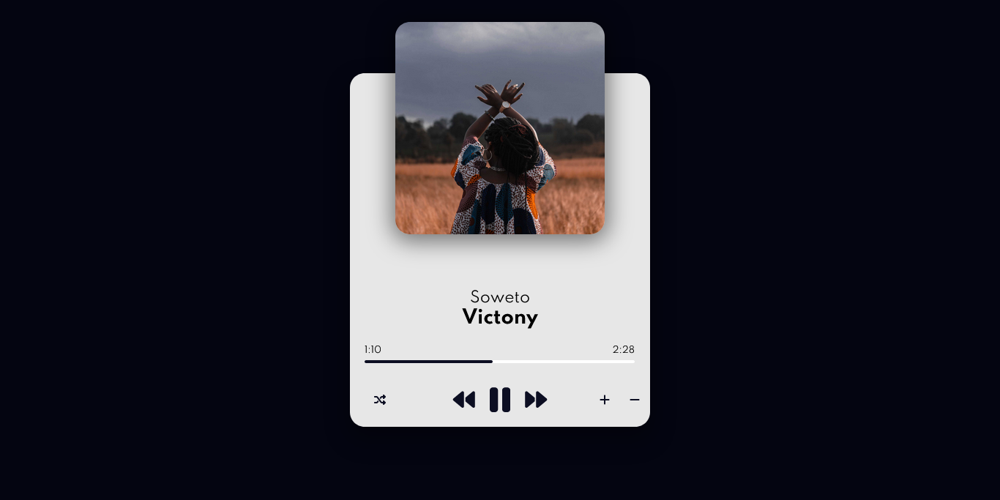
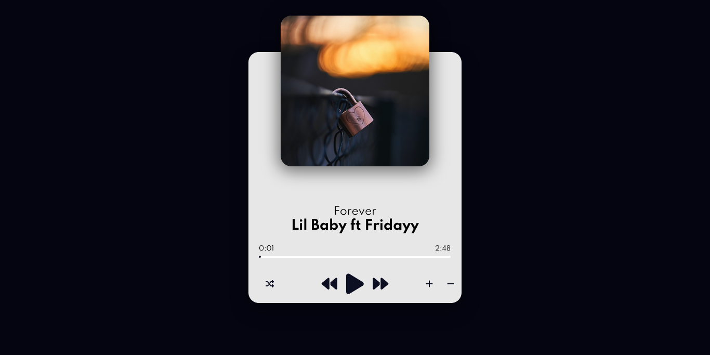
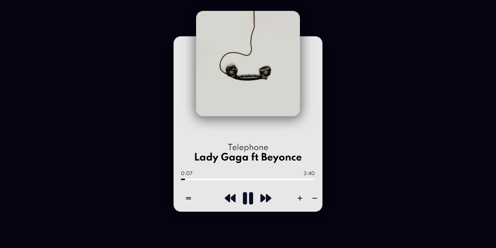
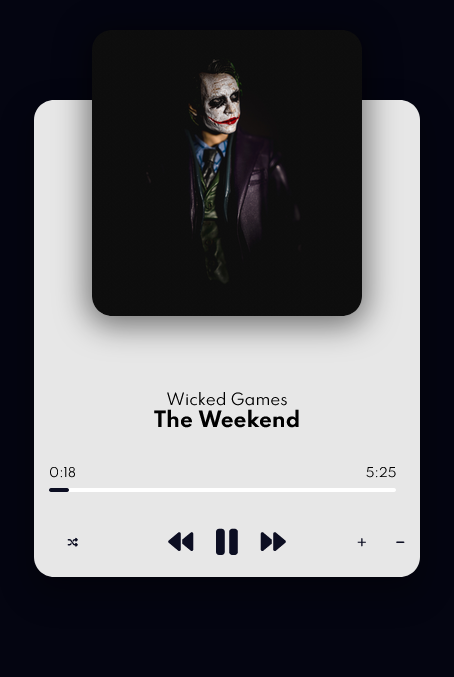

# Music player
A single page web music player

# About
A single page music player built using HTML CSS and Javascript. Features include Play, pause, next, previous, shuffle, un-shuffle, Volume up, volume down, Progress bar and progress bar seeking.

## Table of contents

  - [Screenshot](#screenshot)
  - [Links](#links)
- [My process](#my-process)
  - [Built with](#built-with)
  - [What I learned](#what-i-learned)
  - [Useful resources](#useful-resources)
- [Author](#author)
- [Acknowledgments](#acknowledgments)

### Screenshot

### Links

- Live Site URL: [Click here](https://kb-jr.github.io/Music-player/)

## My process

#### Interface:
- Build User interface using HTML5 and CSS custom properties.
- Import font type from Google fonts API
- Icons from Fontawesome.com

#### Features:
Create an array of objects, the objects are going to hold details of individual songs

##### Play/Pause

- Play: Create a function to play songs. When this function is called, the play Icon is replaced with a pause icon, the title is changed from play to pause and the play() method is executed on the "audio" element.

- Pause: Craete a function to pause songs. When this function is called, the pause Icon is replaced with a play icon, the title is changed from pause to play and the pause() method is executed on the "audio" element.

- A ternary (conditional) operator is used to determine which of the above function should be run when the button is clicked.

##### Load a song
- Create a function to dynamiccaly populate the elements on the page when called. This will be done by assigning values to the elements by using dot notation and string literals. The title and artist text will be populated with displayName and artist property from the object created in the songs array. The music source and image will be parsed in dynamically using string literals. The source directory, the title of the song/image and the extension of the song/image makes up the parameters of the string literal. The namings of the songs and images were made the same as the name property in the song object, so the name property will be parsed in as a variable.

##### Shuffle/Un-shuffle

- Shuffle: Create a function to shuffle songs. When this function is called, the shuffle icon changes, the title changes to Un-shuffle and randomize the objects in the array. Using the Math.random() method, get a random song object. The details of this song object will be loaded to the page using same method for loading a song in the section above. Then the loaded song will be played. This plays a random song from the list of songs

- Un-shuffle: Create a function to unshuffle the songs. This function sets the song to play to the first song in the array. When this function is called, the icon changes to a shuffle icon and the title changes to Shuffle. The index 0 song is selected, loaded and played with the same method as above.

- A ternary (conditional) operator is used to determine which of the above function should be run when the button is clicked.

##### Next and Previous songs for both Shuffled and unshuffled states

- Next Song when Un-shuffled: Create a global variable and set the value of that variable to 0. Create a function to select the song to play when the next button is clicked. Increment the value of the global variable by 1 any time the button is clicked. The data type of this variable is a number, this number will be used as the index of an object in the songs array. So when the load song function is called, it takes the songs array as an argument with the index in square brackets. A condition was set to ensure that when it gets to the end of the list (last index), the next song to be loaded will be the first song (index 0). Add an event listener to the next button to trigger the function when clicked.

- Previous Song when unshuffled: Similar steps with Next song, but instead of incrementing the value of the variable by 1, the value will be decremented by 1. A condition was set to ensure that when it is at the beginning of the list ( index 0), the next song to be loaded will be the last song. Add an event listener to the previous button to trigger the function when clicked.

- Next song when Shuffled: Create a function to load the song to be played when the next button is clicked in a Shuffled state. Create a global variable and store the index of the first song in the array of songs. Within the function, create another function to generate a random number not exceeding the number of objects in the array any time the function is called. Set the value of the created global variable to the random number. This variable sets the index of the song to be loaded from the songs array. Call the function to generate a random number, call the function to load the song with the songs array as parameter and the random number as the index then play song.

- Prev Song when shuffled: Same steps as above

- A ternary (conditional) operator is used to determine which of the above function should be run when the next or previous button is clicked.

##### Volume

Default Volume: Create a function to set the music volume using the volume property on the audio element The maximum volume is 1 while minimum volume is 0. The default volume was set to 0.4. Call the function so that when the page loads the volume is automatically set to 0.4

- Increase volume: Create a function to increase the volume of the audio file. Increment the volume property of the audio element by 0.1 anytime the function is called. The function will be called by a click event on the volume up (+) button.

- Decrease volume: Create a function to Decrease the volume of the audio file. Decrement the volume property of the audio element by 0.1 anytime the function is called. The function will be called by a click event on the volume down (-) button.

##### Progress Bar

- Create a function to update the progress of the song. To implement this, the width of progress will need to be expanding as the song plays. This function will take the "timeUpdate" event as input. If the song is playing, using Destructuring Assignment, assign the source element of the timeUpdate event to duration and current time variables. Divide the current time by the duration and multiply by 100 to get the percentage. Set the width styling property of the progress to the percentage, by doing this, as the song plays, the current time increases, so does the percentage and as a result the width also increases. 

- Update the text content of the duration element in minutes and seconds. Derive the minutes by dividing the duration by 60 and derive the value for seconds by getting the remainder when the duration is divided by 60. Update the text content of the duration element by passing in the derived values as string literals. Repeat same steps to update the current time, but instead of using the duration variable, use the current time variable. 

##### Set Progress
Create a function to set how much of the song has been played. Get the width of the progress bar element by using the clientWidth Property of the Progress Bar. The progress bar is referred to by using the "This" Keyword. Get the point that was clicked from the "offsetX" property of the "click" event. Store the duration of the song in a variable using a destructuring assignment, this acesses the Duration property in the audio file and automatically stores it as a variable with the same name (duration). The current progress is gotten by value of the position clicked by the value of the width of the progress bar then multiplying it by the duration of the song. This function is called when the "click" event fires on the progress bar and it takes the "click" event as input.

## What i learned
- Using Ternary Operators
- Using "This" keyword
- Working with objects and array methods
- Loading data through DOM Manipulation

### Built with

- HTML5 
- CSS custom properties
- Flexbox
- Javascript

### Useful resources

- [Using Ternary (conditional) Operators](https://developer.mozilla.org/en-US/docs/Web/JavaScript/Reference/Operators/Conditional_Operators).

- [Audio methods, events and Properties](https://www.w3schools.com/tags/ref_av_dom.asp) 

- [Destructuring assignment](https://developer.mozilla.org/en-US/docs/Web/JavaScript/Reference/Operators/Destructuring_assignment) 

- [Images](https://unsplash.com) 

- [Icons](https://fontawesome.com)

- [Loader](https://loading.io/) - Download custimisable loading animations 

## Author

- Github - [@Kb-Jr](https://github.com/Kb-Jr)
- Twitter - [@Joker__XL](https://www.twitter.com/Joker__XL)

## Acknowledgments 
- unsplash.com/@ryunosuke_kikuno
- unsplash.com/@alex_andrews
- twitter.com/mynameisjacinto
- unsplash.com/@bogdan_cotos
- unsplash.com/@_kiragu_
- unsplash.com/@morganvongunten
- The Weekend
- Rihanna
- Lady Gaga
- Victony
- Chris Brown
- Omah Lay
- J Cole
- Lil Baby
- Miley Cyrus
- Beyonce
- JoeBoy
- Nicki Minaj